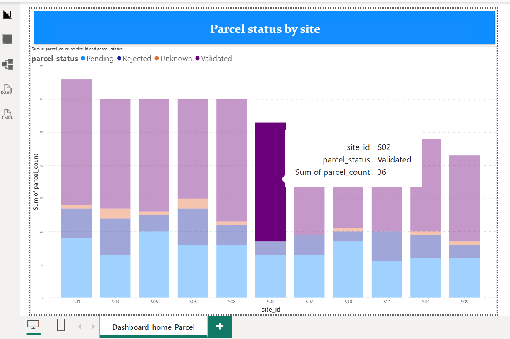

# Data Pipeline: dbt + Python + R + Power BI

Inspired by challenges faced on real field-data projects (HIDS, UN-Habitat/PARF2), this project translates that experience into a modern data engineering pipeline (dbt + Python + R + Power BI), built with synthetic data only - no real HIDS/PARF2 data is used.

## Why this project

Built to practice and demonstrate a dbt-based analytics engineering workflow (staging, marts, automated testing) alongside Python, R, and Power BI, complementing an already solid SQL background.

## On scope: why dbt for 600 rows

At this data volume, a direct CSV import into Power BI would have been functionally sufficient. This project deliberately builds the full dbt layer anyway, because the value of dbt (a single tested source of truth, no duplicated logic across tools, automated data quality checks) becomes real at team scale and larger data volumes, not at 600 rows. The goal here is to practice and demonstrate that discipline on a manageable dataset, not to claim this architecture was necessary for this specific size of data.

## Architecture

Synthetic seeds (CSV) -> dbt staging (cleaning) -> dbt marts (aggregation, tested) -> DuckDB -> consumed by Python (pandas/matplotlib), R (dplyr), and exported (CSV/Parquet) for Power BI.

## Stack

- dbt-core + DuckDB: transformation, automated testing, documentation (dbt docs)
- Python (pandas, numpy, matplotlib, duckdb): direct analysis on the mart
- R (readr, dplyr): reading/adapting an existing script - not built from scratch
- Power BI: Parquet import, stacked bar chart by site and status

## Power BI report

## How to reproduce

Install dependencies, then run the pipeline:
dbt seed, dbt run, dbt test, dbt docs generate,
then the Python and R scripts in python_analysis/ and r_script/.

## Repository structure

Main folders: models/staging (dbt cleaning), models/marts (dbt aggregation, tested),
seeds (synthetic source data), python_analysis (pandas scripts), r_script (R script),
powerbi (report and screenshot), exports (CSV/Parquet for R and Power BI).

## Status

| Component | Status |
|---|---|
| dbt pipeline (seeds, staging, tests, mart) | Done |
| dbt documentation | Done |
| Python analysis and export | Done |
| R script | Done |
| Power BI report | Done |

## Honesty note

This is a self-directed learning project on synthetic data, not professional production experience.
R and Power BI are intentionally scoped narrow: R is limited to reading and adapting an existing
script, and Power BI complements the pipeline as a BI layer. Core analytics stack remains SQL and Python.
